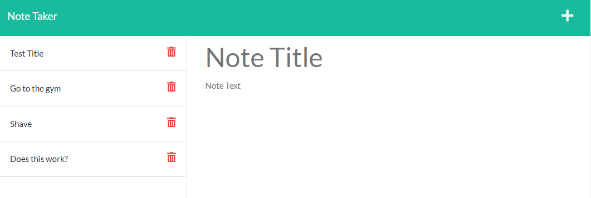

# Personal Note Taker

## Description
This application can be used to write and save personal notes. This application uses an Express.js backend and will save and retrieve note data from a JSON file. 
  
## Live Website
https://arcane-hamlet-44138.herokuapp.com/

<br/>

## Usage
First, clone the code to your local machine then cd into the develop folder, then you can type 

```
npm install express
```
then 
```
npm install uuid
```
afterwards you can execute the application using ```node server``` in the terminal line.


## Reference Screenshot


## Credits
Front-end provided by lerantino in associated with UW Extended Campus <br />

## Questions
Feel free to reach out to me for any questions or comments. <br/>
Link to my GitHub: github.com/colevibes